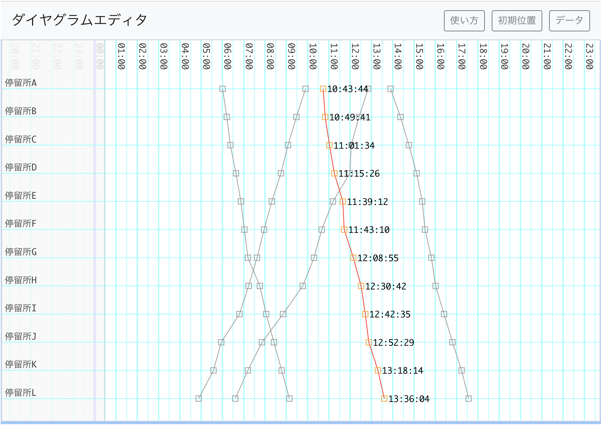

# Diagram Editor

ウェブベースのダイアグラムエディタです。

東京公共交通オープンデータチャレンジのAPIを使ってデータを読み込むことができます。

<p align="center">
  
</p>

## デモアプリ

以下のページでデモアプリを試用できます。

[https://yamagame.github.io/diagram-editor](https://yamagame.github.io/diagram-editor)

## 準備

npm コマンドを使って node_modules を作成します。

```
$ npm install
```

## ビルト

以下のコマンドでビルドします。ビルドすると docs フォルダにアプリが作成されます。

```
$ npm run build
```

## 使い方

アプリの使い方は下記のスライドをご覧ください。

[ダイアグラムエディタの使い方](https://docs.google.com/presentation/d/1F0RfbHgcRPHgPSxpe61pBMZ8Yf0WGaXe7XT06Y3AWkk/edit?usp=sharing)
